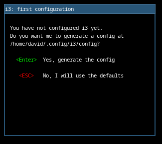
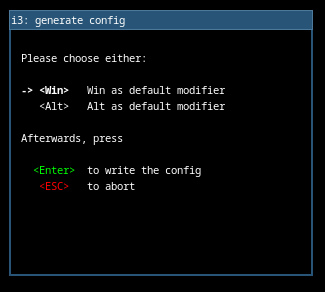

# debian-n3ph0s
Debian 12 Installation 

## To Install:

```
sudo apt install git -y
git clone https://github.com/n3ph0s/debian-n3ph0s.git
cd debian-n3ph0s
chmod +x install.sh
sudo ./install.sh
```
## Post Install

After the first login you will be presented with the option to create a default i3wm configuration file and press enter twice to accept the defaults





After you have selected this press Super+Return to launch a terminal then execute the following commands

```
cd debian-n3ph0s/
chmod +x post-install.sh
./post-install.sh
```
*NOTE*: You will be prompted for the root password when installing the starship prompt
